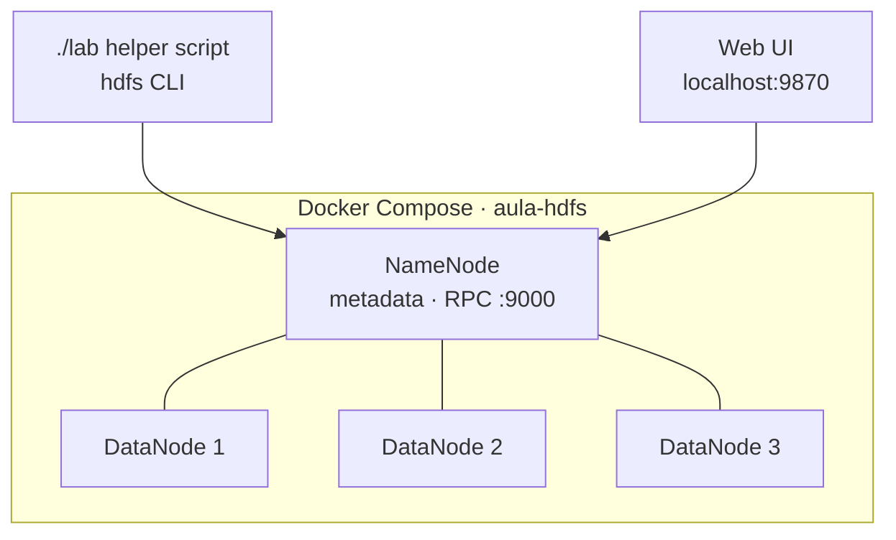

<div align="center">

# 🎓 Machine Learning Systems — Coursework

**Course work from the Big Data & AI specialisation: a distributed HDFS cluster in Docker, and exploratory data analysis that prepares real-world-style datasets for machine learning.**


</div>

---

## Contents

| Module | Topic | Dataset | Key skills |
|---|---|---|---|
| **HDFS lab** | Distributed storage | — | Docker Compose cluster, NameNode / DataNodes, replication, `dfsadmin` |
| **Practice 3** | Exploring a dataset with pandas | Telecom customers · 180 × 10 | Loading, typing, filtering, descriptive stats, defining X and y |
| **Practice 4** | Anatomy of an ML dataset | E-commerce customers · 400 × 12 | Variable roles, data quality, labelled vs. unlabelled, framing problems |
| **Practice 5** | Exploratory Data Analysis | E-commerce customers · 400 × 12 | Distributions, IQR outliers, correlation, group comparisons, hypotheses |

---

## 🗄️ HDFS cluster lab

A four-node Hadoop cluster running locally in Docker, used as the storage layer for the rest of the course.



| Setting | Value | Why it matters |
|---|---|---|
| Hadoop version | 3.4.2 on Eclipse Temurin JRE 11 | Built from the official tarball with **SHA-512 verification** |
| Replication factor | 2 | Each block survives the loss of one DataNode |
| Block size | 16 MB (default 128 MB) | Small files still get split across nodes, so distribution is visible in a lab |
| Heartbeat | 1 s, recheck 5 s | Dead nodes are detected in seconds, which makes failure experiments observable |
| Resources | 1 GB RAM, 512 MB heap per container | Runs on a laptop |
| Persistence | Named volumes per node | `docker compose stop` keeps HDFS state |

```bash
cd LABORATORIO_ALUMNOS_HDFS
chmod +x lab
docker compose build namenode
docker compose up -d namenode dn1 dn2 dn3
./lab h dfsadmin -report        # expect: Live datanodes (3)
```

> The lab environment is provided by the course; the work here is deploying, operating and experimenting with it.

---

## 📊 Data analysis notebooks

### Practice 3 — Telecom customer churn (exploration)
**Business question:** which customers are at risk of leaving?

- 180 customers, 10 variables; **70 of them (38.9 %) churned**, a moderately imbalanced target.
- Identified missing values from `info()` (`antiguedad`, `consumo_datos`), and why an ID column must never be used as a feature.
- Combined filters with `query()` (e.g. young customers with 3+ support calls) and a reflection on **correlation vs. causation**: low satisfaction alongside churn does not prove one causes the other.

### Practice 4 — Anatomy of an ML dataset
**Business question:** will a customer buy next month?

- 400 customers, 12 variables (demographics, spend, purchases, returns, device, region, loyalty tier); target `compra_proximo_mes` (**38.5 % positive**).
- Classified every variable by type and role, built `X` and `y`, and framed **three different ML problems** from the same table: purchase prediction, next-month spend, and unsupervised customer segmentation.
- Early signal: customers who buy next month spend **€76.3/month on average vs. €64.6** for those who don't.

### Practice 5 — Exploratory Data Analysis
- Distribution analysis with histograms and boxplots, and **IQR outlier detection**: 9 outliers in monthly spend (upper fence ≈ €166).
- Caught a **data-entry error**: a customer aged 195, flagged by the same IQR method applied to age.
- Missing values located in tenure (5), income (4) and spend (3).
- Correlation matrix and heatmap, numeric-vs-categorical comparisons, categorical cross-tabs and a hypothesis tested against the data.

## Run the notebooks

```bash
pip install numpy pandas matplotlib jupyter
jupyter notebook "Notebooks S.aprendizaje"
```

## Project structure

```text
├── LABORATORIO_ALUMNOS_HDFS/
│   ├── compose.yaml          # NameNode + 3 DataNodes
│   ├── hadoop/               # Dockerfile, core/hdfs/mapred-site.xml, start.sh
│   └── lab                   # Helper script for HDFS commands
└── Notebooks S.aprendizaje/
    ├── UD1/                  # Practice 3 + clientes.csv
    └── UD2/                  # Practices 4–5 + clientes_ecommerce.csv
```

---

<div align="center">

Coursework by **Marcos** · [@mmartinezvaras](https://github.com/mmartinezvaras)

</div>
